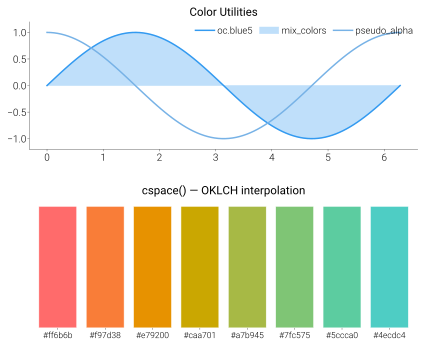

Color Utilities
===============

Importing ``dartwork_mpl`` registers a large catalog of named colors with
matplotlib (``oc.*`` plus Tailwind ``tw.``, Material ``md.``, Ant Design
``ad.``, Chakra ``cu.``, and Primer ``pr.`` prefixes). In addition to the
named palette, a ``Color`` class provides perceptually uniform color
manipulation across OKLab, OKLCH, RGB, and hex color spaces.

Example
-------

.. code-block:: python

   import matplotlib.pyplot as plt
   import dartwork_mpl as dm

   # Named colors
   plt.plot(x, y, color="oc.blue5", label="Series A")
   lighter = dm.mix_colors("oc.blue5", "white", alpha=0.35)
   muted_line = dm.pseudo_alpha("oc.blue7", alpha=0.6)

   # Color class — perceptual manipulation
   color = dm.oklch(0.7, 0.15, 150)
   color.oklch.C *= 1.2                  # boost chroma
   print(color.to_hex())                 # '#...'

   # Interpolation
   palette = dm.cspace('#FF6B6B', '#4ECDC4', n=5, space='oklch')
   for i, c in enumerate(palette):
       ax.bar(i, 1, color=c.to_hex())

API
---

Color Manipulation
^^^^^^^^^^^^^^^^^^

.. automodule:: dartwork_mpl.colors
   :members:
   :undoc-members:
   :show-inheritance:

.. note::

   ``mix_colors`` and ``pseudo_alpha`` are defined in the ``util`` module
   but re-exported from the top-level ``dartwork_mpl`` namespace for
   convenience alongside other color helpers.

.. autofunction:: dartwork_mpl.mix_colors
.. autofunction:: dartwork_mpl.pseudo_alpha

Color Interpolation
^^^^^^^^^^^^^^^^^^^

.. autofunction:: dartwork_mpl.cspace

Palette Discovery
^^^^^^^^^^^^^^^^^

.. autofunction:: dartwork_mpl.list_palettes
.. autofunction:: dartwork_mpl.list_colormaps
.. autofunction:: dartwork_mpl.show_palette

Visualization Tools
^^^^^^^^^^^^^^^^^^^^

.. autofunction:: dartwork_mpl.plot_colors
.. autofunction:: dartwork_mpl.plot_colormaps
.. autofunction:: dartwork_mpl.classify_colormap
