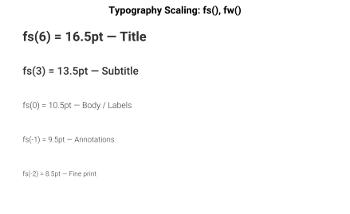

Font Utilities
==============

Custom fonts bundled in ``asset/font`` are registered with matplotlib on import,
so they are available without manual configuration.  Scaling helpers ``fs``,
``fw``, and ``lw`` offset the global rcParams base values; ``plot_fonts``
previews every installed family.

.. tip::

   For detailed usage examples, weight reference tables, and best practices
   see :doc:`/fonts/utilities`.

Quick API
---------

``fs(n)``  — font size + *n* points.

``fw(n)``  — font weight + 100×*n* (string weights auto-converted).

``lw(n)``  — line width + *n*.

``plot_fonts(font_dir=None, ncols=3, font_size=11)``
   — returns a ``Figure`` with a preview grid of all available families.

Example
-------

.. code-block:: python

   import matplotlib.pyplot as plt
   import dartwork_mpl as dm

   fig, ax = plt.subplots()
   ax.set_title("Paper-ready", fontsize=dm.fs(2), fontweight=dm.fw(1))
   ax.plot(x, y, lw=dm.lw(0.5))       # base linewidth + 0.5
   dm.plot_fonts(ncols=4, font_size=12)  # inspect available families

.. automodule:: dartwork_mpl.font
   :members:
   :undoc-members:
   :show-inheritance:

.. autofunction:: dartwork_mpl.fs
.. autofunction:: dartwork_mpl.fw
.. autofunction:: dartwork_mpl.lw

