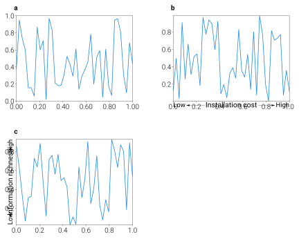

Layout Utilities
================

Utilities for tightening layouts without juggling ``plt.subplots_adjust``.
``simple_layout`` optimizes margins with L-BFGS-B so axes fit inside a bounding
box; ``make_offset`` nudges text/legends in point units; ``label_axes`` adds
standardized panel labels; ``arrow_axis`` draws annotated bidirectional arrows;
and ``set_decimal``/``get_bounding_box`` provide quick helpers when formatting axes.

Example
-------

.. code-block:: python

   import matplotlib.pyplot as plt
   import numpy as np
   import dartwork_mpl as dm

   fig, axes = plt.subplots(1, 3, figsize=(dm.DW, dm.DW * 0.35))
   for ax in axes:
       ax.plot(np.linspace(0, 1, 40), np.random.rand(40), color='oc.blue6')

   # Panel labels
   dm.label_axes(axes)  # adds a, b, c

   # Layout optimization
   dm.simple_layout(fig, margins=(0.08, 0.05, 0.1, 0.08))

   # Decimal formatting
   dm.set_decimal(axes[0], xn=2, yn=1)

   # Arrow annotations
   dm.arrow_axis(axes[1], 'x', 'Installation cost')
   dm.arrow_axis(axes[2], 'y', 'Information richness')

API
---

.. autofunction:: dartwork_mpl.cm2in
.. autofunction:: dartwork_mpl.simple_layout
.. autofunction:: dartwork_mpl.make_offset
.. autofunction:: dartwork_mpl.label_axes
.. autofunction:: dartwork_mpl.arrow_axis
.. autofunction:: dartwork_mpl.layout.get_bounding_box
.. autofunction:: dartwork_mpl.util.set_decimal
