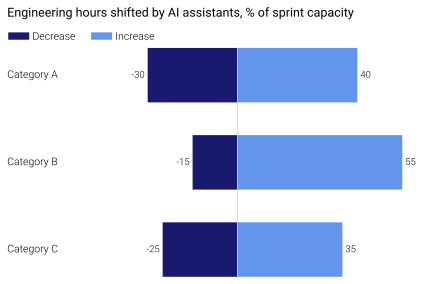

Plot Templates (``dm.templates``)
=================================

A small, intentionally-narrow set of ready-to-use plot templates for
chart types that are tedious to build from raw matplotlib but show
up constantly in real reports. Templates are added only when a
pattern repeats across enough projects to deserve a curated default.

Currently available:

- :func:`~dartwork_mpl.plot_diverging_bar` — symmetrical
  positive / negative bar layout with integrated legend.

.. note::

   Upgrading from an older alias? See the :doc:`Migration Guide
   <../migration>` for the full list of renamed paths and one-shot
   migration scripts.

Example
-------

.. code-block:: python

   import numpy as np
   import dartwork_mpl as dm
   from dartwork_mpl.templates import plot_diverging_bar

   dm.style.use("presentation")

   fig, ax = plot_diverging_bar(
       labels=["Category A", "Category B", "Category C"],
       neg_values=np.array([-30, -15, -25]),
       pos_values=np.array([40, 55, 35]),
       neg_label="Decrease",
       pos_label="Increase",
   )

   dm.simple_layout(fig)
   dm.save_formats(fig, "diverging_bar", formats=("png", "svg"))

The same callable is exposed at the top level as
``dm.plot_diverging_bar(...)``.

API
---

.. automodule:: dartwork_mpl.templates
   :members:
   :undoc-members:
   :show-inheritance:

.. automodule:: dartwork_mpl.templates.diverging_bar
   :members:
   :undoc-members:
   :show-inheritance:
