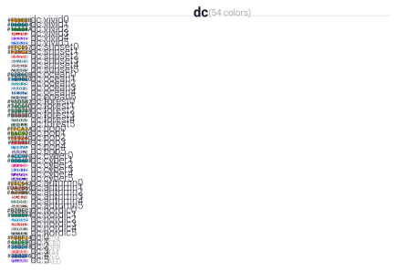

Visualization Tools
===================

Quick visual diagnostics for the assets bundled with dartwork-mpl. Use them to
review palettes, pick colormaps by category, or validate fonts before building
plots.

Example
-------

.. code-block:: python

   dm.plot_colormaps(group_by_type=True)  # Opens grouped figures
   dm.plot_colors(ncols=5)                # Shows named colors by library
   dm.plot_fonts(font_size=10)            # Preview installed font families

API
---

.. autofunction:: dartwork_mpl.plot_colormaps
.. autofunction:: dartwork_mpl.plot_colors
.. autofunction:: dartwork_mpl.plot_fonts
.. autofunction:: dartwork_mpl.classify_colormap
