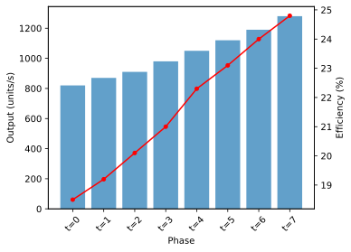
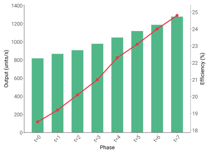

# Font Families

dartwork-mpl bundles 9 professional font families with a total of 130 font
variants. Each family is optimized for different use cases in data visualization.

## Why fonts matter

The right typeface can transform a chart from amateur to professional. Here's
the same data plotted with default matplotlib fonts (left) and dartwork-mpl fonts (right):

```{raw} html
<div class="dm-comparison-grid">
  <div class="dm-comparison-panel">
    <span class="dm-comparison-label">Before — Default matplotlib</span>
    
  </div>
  <div class="dm-comparison-panel">
    <span class="dm-comparison-label">After — dartwork-mpl</span>
    
  </div>
</div>
```

## Font Selection Guide

Not sure which font to use? Pick based on your primary need:

| Need                         | Recommended Font           | Why                                         |
| ---------------------------- | -------------------------- | ------------------------------------------- |
| **General chart text**       | Roboto (default)           | Clean, legible at all sizes                 |
| **UI-style dashboards**      | Inter                      | Tall x-height, excellent screen readability |
| **Titles & headings**        | InterDisplay               | Tighter spacing optimized for large text    |
| **Dense tables / legends**   | Noto Sans Condensed family | Same readability, narrower footprint        |
| **Korean text (한글)**       | Paperlogy                  | Native Korean design, 9 weights             |
| **CJK (日本語 / 中文)**      | Noto Sans CJK              | Comprehensive CJK glyph coverage            |
| **Math / scientific**        | Noto Sans Math             | Full symbol set: ∑ ∫ √ ∞ π θ α β γ          |
| **Multi-language documents** | Noto Sans                  | Broadest Unicode coverage                   |

## Fonts in Chart Context

Each font plays a specific role in a chart. This annotated example shows which
font is used where:

```{image} _generated/chart_context.svg
:alt: Chart fonts in context
:align: center
```

> **Title** uses InterDisplay Bold for maximum impact. **Axis labels** use
> Roboto Regular for clear identification. **Tick marks** use Roboto Light
> for unobtrusive readability.

## Font Pairing Recommendations

Curated combinations for common chart styles.

## Size Scale

See how each font performs at the sizes commonly used in charts (8px tick labels
→ 24px titles).

---

## Multi-Language Support

All fonts below are **bundled** — no system font installation required:

```{raw} html
:file: _generated/multilang.html
```

---

## Font Family Details

Every specimen below is rendered **live in your browser** using the actual
bundled font files — no images, no placeholders.

### Roboto (Default)

```{raw} html
:file: _generated/roboto_showcase.html
```

Google's flagship sans-serif typeface and the **default font in dartwork-mpl**.
Roboto features friendly, open curves while maintaining a mechanical skeleton,
making it highly legible at all sizes.

**Author:** Christian Robertson · **License:** [Apache 2.0](https://fonts.google.com/specimen/Roboto)

:::{admonition} All weights
:class: dropdown

```{raw} html
:file: _generated/roboto.html
```

:::

---

### Inter

```{raw} html
:file: _generated/inter_showcase.html
```

A modern sans-serif typeface designed specifically for computer screens. Inter
features a tall x-height for improved readability at small sizes and includes
many OpenType features.

**Author:** [Rasmus Andersson](https://rsms.me/inter/) · **License:** [OFL 1.1](https://github.com/rsms/inter)

:::{admonition} All weights
:class: dropdown

```{raw} html
:file: _generated/inter.html
```

:::

---

### InterDisplay

```{raw} html
:file: _generated/interdisplay_showcase.html
```

The display variant of Inter, optimized for larger sizes. Features tighter
letter-spacing and refined details that shine at headline sizes.

**Author:** [Rasmus Andersson](https://rsms.me/inter/) · **License:** [OFL 1.1](https://github.com/rsms/inter)

:::{admonition} All weights
:class: dropdown

```{raw} html
:file: _generated/interdisplay.html
```

:::

---

### Noto Sans

```{raw} html
:file: _generated/notosans_showcase.html
```

Google's Noto Sans provides harmonious typography across hundreds of languages.
The name "Noto" comes from "No Tofu"—the goal of eliminating the blank boxes
(tofu) that appear when a font lacks a glyph.

**Author:** Google · **License:** [OFL 1.1](https://fonts.google.com/noto/specimen/Noto+Sans)

:::{admonition} All weights
:class: dropdown

```{raw} html
:file: _generated/notosans.html
```

:::

---

### Condensed Variants

The Noto Sans family includes three condensed variants. Choose based on how much
horizontal space you need to save:

```{raw} html
:file: _generated/condensed_comparison.html
```

#### Noto Sans Condensed

```{raw} html
:file: _generated/notosans_condensed_showcase.html
```

:::{admonition} All weights
:class: dropdown

```{raw} html
:file: _generated/notosans_condensed.html
```

:::

#### Noto Sans SemiCondensed

```{raw} html
:file: _generated/notosans_semicondensed_showcase.html
```

:::{admonition} All weights
:class: dropdown

```{raw} html
:file: _generated/notosans_semicondensed.html
```

:::

#### Noto Sans ExtraCondensed

```{raw} html
:file: _generated/notosans_extracondensed_showcase.html
```

:::{admonition} All weights
:class: dropdown

```{raw} html
:file: _generated/notosans_extracondensed.html
```

:::

---

### Noto Sans Math

```{raw} html
:file: _generated/notosansmath.html
```

A dedicated font for mathematical typesetting. Provides comprehensive coverage
of mathematical symbols, operators, and special characters.

**Variants:** 1 (Regular only)\
**Author:** Google · **License:** [OFL 1.1](https://fonts.google.com/noto/specimen/Noto+Sans+Math)

---

### Paperlogy

```{raw} html
:file: _generated/paperlogy_showcase.html
```

A clean, professional typeface designed for documents. Paperlogy offers excellent
readability in dense text environments. **Includes full Korean (한글) glyph
support.**

**Author:** [Freesentation](https://freesentation.blog/paperlogyfont) · **License:** OFL 1.1

:::{admonition} All weights
:class: dropdown

```{raw} html
:file: _generated/paperlogy.html
```

:::

---

## Font Weight Reference

| Weight Name | Numeric Value | Description              |
| ----------- | ------------- | ------------------------ |
| Thin        | 100           | Extremely light          |
| ExtraLight  | 200           | Very light               |
| Light       | 300           | Light (dartwork default) |
| Regular     | 400           | Normal                   |
| Medium      | 500           | Slightly bold            |
| SemiBold    | 600           | Semi-bold                |
| Bold        | 700           | Bold                     |
| ExtraBold   | 800           | Extra bold               |
| Black       | 900           | Maximum weight           |

**Using Weights:**

```python
import dartwork_mpl as dm

dm.style.use("scientific")  # Base weight = 300 (Light)

# Use the fw() helper for relative weight adjustments
ax.set_title("Title", fontweight=dm.fw(4))   # 300 + 400 = 700 (Bold)
ax.set_xlabel("Label", fontweight=dm.fw(0))  # 300 (base, Light)
```
