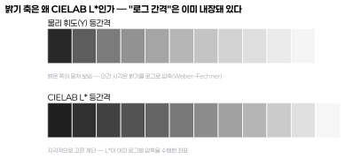
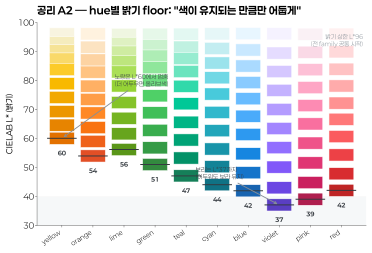
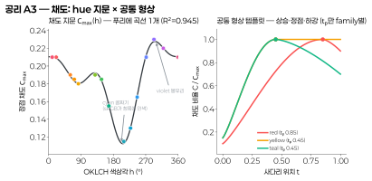
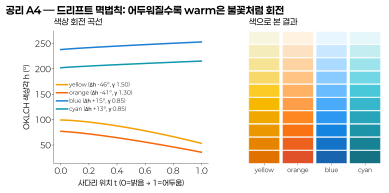
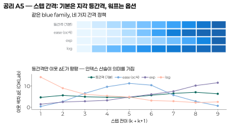
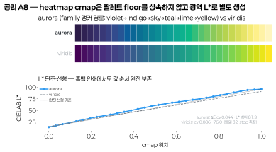
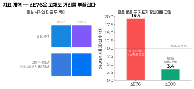
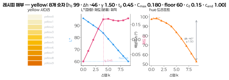
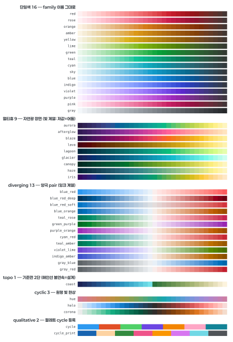
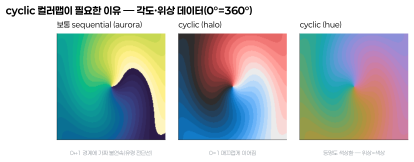

# dartwork color system v5 — 생성 공리 기반 색 시스템 설계

> **Status**: Design (approved for planning) · **Date**: 2026-07-03 · **Author**: color-system working session
> **Scope**: `dartwork_mpl.colors` 전면 재설계 — 팔레트·컬러맵·색 공간·categorical cycle·시맨틱 토큰
> **SSOT**: 이 문서 + [`assets/2026-07-03-color-system-v5/color_v5_ssot.json`](assets/2026-07-03-color-system-v5/color_v5_ssot.json)

---

## 0. 한 문단 요약

dartwork의 색 시스템을 **소수의 생성 공리 + family당 소수 파라미터**로 재구축한다. 기존에는 여러
외부 팔레트를 병렬로 싣고 56개 컬러맵을 손으로 관리했다. v5는 이를 **단일 `dc` 네임스페이스**로
통합하되, 색을 하드코딩 테이블로 두지 않고
**91개의 숫자(family 파라미터 60 + 전역 hue 곡선 24 + 상수 7)에서 결정론적으로 생성**한다.
모든 색은 지각 색과학(CIELAB · OKLCH · CIEDE2000 · Machado CVD)의 검정 가능한 규칙을 통과하며,
학술 출판·공학 시각화·금융 리포트를 아우르는 범용 라이브러리로 설계되었다. 이 문서는 그 설계
**철학과 근거를 SSOT로 기록**한다.

---

## 1. 동기 — 왜 색 시스템을 다시 만드는가

기존 시스템의 구조적 문제는 세 가지였다.

1. **중복과 비일관.** 여러 외부 팔레트를 병렬로 싣다 보니 같은 역할의 색이 팔레트마다 다르게
   정의됐다. 어떤 파랑을 써야 하는지 규칙이 없었고, 팔레트마다 밝기·채도 척도가 달라 한 그림
   안에서 섞이면 시각적 무게가 어긋났다.
2. **손으로 만든 컬러맵의 품질 편차.** 56개 컬러맵의 hex가 지각적으로 불균등했다(L\* 비단조,
   gamut-stale, 방향 뒤섞임). "지각 균일"을 표방하면서 실제로는 그렇지 않은 것들이 다수였다.
3. **근거 부재.** 왜 이 색인지 설명할 수 있는 규칙이 없었다. 색을 추가·수정할 때마다 감으로
   골랐고, 그 결정이 문서화되지 않아 재현·검증이 불가능했다.

v5의 목표는 **"이 색은 왜 이런가"에 매번 답할 수 있는 시스템**이다. 색 하나하나가 아니라 색을
*생성하는 규칙*을 설계하고, 그 규칙이 지각 과학과 정합하는지 수치로 증명한다.

---

## 2. 설계 철학 (3대 원칙)

### 원칙 1 — 지각 좌표 위에서 설계한다 (Perceptual-first)

색을 RGB나 HSV가 아니라 **인간 시각의 균일성에 맞춰 설계된 좌표**에서 조작한다. 밝기는
CIELAB L\*, 색상·채도는 OKLCH. 이유는 §4에서 그림과 함께 설명한다. 핵심은 "숫자로 등간격"과
"눈으로 등간격"을 일치시키는 것이다.

### 원칙 2 — 테이블이 아니라 생성기다 (Generative, not tabular)

색을 저장하지 않고 **생성한다.** 각 family는 8개의 숫자로 정의되고, 컴파일러가 그 숫자에서
10단계 사다리를 만든다. 이 방식의 이점:

- **일관성이 강제된다.** 모든 family가 같은 규칙을 통과하므로 시각적 무게가 자동으로 정렬된다.
- **확장이 규칙화된다.** 새 색상축을 추가할 때 감이 아니라 곡선 위의 한 점을 고른다.
- **검증이 가능하다.** family별 설계 값이 hue의 매끄러운 함수(저차 곡선) 위에 놓이는지 R²·RMSE로
  확인한다 — 15개의 임의 숫자가 아니라 하나의 곡선이라는 증거.

### 원칙 3 — 무엇을 보증하고 무엇을 보증하지 않는지 명시한다 (Honest guarantees)

색과학은 트레이드오프의 학문이다. 한 지표에서 완벽한 팔레트는 다른 지표에서 반드시 타협한다.
v5는 이를 숨기지 않는다 — **세 개의 지표(§6)를 모두 공시하고, 각 산출물이 어떤 보증을 갖고 어떤
한계를 갖는지 문서에 명기**한다. "접근성 안전"이나 "지각 균일" 같은 주장은 항상 *어떤 지표
기준으로* 참인지와 함께 제시된다.

---

## 3. 설계 방법 — 과학은 뼈대, 미학은 살

색과학은 팔레트의 **뼈대**만 정한다: 밝기가 지각적으로 균일해야 하고(L\*), 색상이 사다리를 따라
일정해야 하며(OKLCH), sRGB 안에 들어야 하고(gamut), 색각이상에서 구분돼야 한다(CVD). 그러나 이
제약을 만족하는 팔레트는 무수히 많다 — 어떤 노랑이 얼마나 어두워질지, 채도가 어디서 정점을 찍을지,
색상이 얼마나 회전할지는 과학이 정해주지 않는 **미학의 영역**이다.

v5의 방법은 이 미학적 결정을 **hue의 매끄러운 함수로 인코딩**하는 것이다. family마다 밝기 floor·정점
채도·드리프트를 따로 감으로 고르지 않고, 저차 곡선(푸리에 k=2~3) 하나로 전 family를 관통하게 한다.
이 방식의 두 이점:

- **일관성.** 인접 hue의 색이 자연스럽게 이어진다(cyan이 유독 탁하거나 violet만 튀지 않는다).
- **확장성.** 새 색상축을 추가할 때 곡선 위의 한 점을 읽으면 되므로, 감이 아니라 규칙으로 확장된다.

각 곡선이 얼마나 매끄러운지는 R²·RMSE로 검증한다(각 공리에 명시). 미학적 판단을 반복적으로 다듬어
곡선에 담고, 그 곡선이 A7 게이트(§5)를 통과하는지로 검증하는 것이 v5의 설계 루프다.

---

## 4. 색 공간의 토대 (공리 A1)

**A1 — 밝기는 CIELAB L\*(D65), 색상·채도는 OKLCH, sRGB 밖 색은 CSS Color 4 방식(L\*·h 유지, C 축소)으로
매핑, 모든 게이트는 ΔE로 판정한다.**

### 왜 밝기에 CIELAB L\*인가 — "로그 간격"은 이미 내장돼 있다



인간의 밝기 지각은 물리 휘도(Y)에 로그형으로 반응한다(Weber–Fechner 법칙). 위 그림의 윗줄은
물리 휘도를 등간격으로 나눈 것인데, 밝은 쪽이 뭉쳐 보인다 — 눈은 밝은 영역의 차이에 둔감하기
때문이다. 아랫줄은 CIELAB L\*을 등간격으로 나눈 것으로, 지각적으로 고른 계단이 된다.

**이것이 스텝 간격에 대한 답이기도 하다.** "색 사이 간격을 선형이 아니라 로그로 하면 어떤가"라는
직관은 이미 시스템 안에 반영돼 있다 — L\*이 바로 그 로그 압축을 수행한 좌표이기 때문이다
(L\*50 ≈ 흰색 물리 휘도의 18%). 따라서 **L\* 위에서 등간격 = 물리적으로는 이미 로그 간격**이며, 그
위에 다시 로그를 걸면 압축이 이중 적용되어 지각적으로 오히려 불균등해진다.

### 왜 색상·채도에 OKLCH인가

CIELAB은 밝기에는 훌륭하지만 색상 조작에서 결함이 있다(파랑을 밝게 하면 보라로 밀리는 hue shift).
OKLCH(Björn Ottosson, 2020)는 색상을 일정하게 유지하며 밝기·채도를 독립적으로 조작할 수 있어,
사다리를 만들 때 색상 정체성을 지킨다. 그래서 **밝기 척도는 CIELAB L\*, 조작은 OKLCH**로 역할을 나눈다.

### sRGB gamut 매핑

OKLCH로 지정한 색이 sRGB 밖일 때, 순진하게 clip하면 색상이 틀어진다. CSS Color 4 표준 방식으로
**L\*과 색상은 유지한 채 채도만 이진 탐색으로 줄여** gamut 안으로 들인다. 이 매핑은 dartwork에
이미 구현돼 있다.

---

## 5. 생성 공리 (A2–A8)

각 공리는 검정 가능한 규칙이며, 채택 근거(곡선 적합도)와 기각된 대안을 함께 기록한다.

### A2 — hue별 밝기 floor

**모든 family는 L\*96에서 시작해 hue 고유의 floor까지 내려간다. floor는 gamut 한계가 아니라 푸리에
곡선 `floor(h)`로 정의되는 지각적 설계 값이다.**



노랑은 L\*60에서 멈춘다 — 더 어두우면 올리브색 진흙이 된다. 보라는 L\*37까지 내려가도 보라로
남는다. 각 hue는 **색이 유지되는 만큼만 어둡게** 간다. 이것이 팔레트가 "밝고 산뜻한" 느낌을 갖는
핵심이다(전 family를 같은 최저 밝기로 끌어내리면 warm 계열이 탁해진다).

- **기각된 대안**: "floor = 채도가 정점의 λ배로 떨어지는 gamut 벽"이라는 가설. 물리적으로
  우아했지만 설계 floor 값과 RMSE 15 L\*로 맞지 않아 **기각**. floor는 물리적 한계가 아니라 지각적
  설계 값이다.
- **채택**: `floor(h)` 를 푸리에 k=3 곡선으로 두면 family들의 floor 값이 RMSE 0.77 L\*로 곡선 위에
  놓인다 — floor는 hue의 매끄러운 함수다. 신규 family의 floor는 이 곡선에서 자동 유도된다.

### A3 — 채도: hue 지문 × 공통 형상

**정점 채도 `C_max(h)`는 hue의 매끄러운 함수(푸리에 k=3)이고, 채도의 사다리 곡선 형상은 전 family
공통 템플릿(상승 → 정점 t_p → 하강)이며 정점 위치 t_p만 family별로 다르다.**



왼쪽: 정점 채도 `C_max(h)`는 곡선 하나로 15개 family를 설명한다(R²=0.945). cyan 골짜기(sRGB가
청록에 인색한 물리적 사실)와 violet 봉우리가 자동으로 나온다. 오른쪽: 채도가 오르내리는 *모양*은
모두 같고(상승 sin^1.2 → 정점 → 하강 t^1.5), 언제 정점을 찍는지(t_p)만 다르다. red는 어두운 쪽(0.85)에서,
yellow는 중간(0.45)에서 가장 쨍하다. 경계값 `c₀(h)`(파스텔 시작)·`c_end(h)`(어두운 끝 잔존)도 푸리에
곡선이다(c_end RMSE 0.020 — warm은 어두워도 채도 유지, cool은 감쇠).

### A4 — 드리프트 멱법칙

**색상은 밝기의 함수로 회전한다: `h(t) = h₀ + Δh·t^γ`. 어두워질수록 warm은 크게(불꽃처럼 주황·적색으로),
cool은 소폭 회전한다.**



yellow는 Δh −46°로 크게 회전하고(밝은 레몬 → 어두운 호박), blue는 +15°로 소폭 회전한다. γ는 회전이
*언제* 일어나는지를 조절한다(γ>1이면 어두운 구간에서 가속). 멱법칙 하나로 전 family의 드리프트를
wRMSE ≤1.7°로 표현한다. 이 드리프트가 어두운 색을 탁하지 않고 생생하게 유지하는 미학의 핵심이다.

### A5 — 스텝 배치 = 지각 등간격 (+ 워프 옵션)

**10단계는 색 경로 위에서 이웃 ΔE가 균등해지도록 반복 재배치한다(등간격). 간격 정책은 워프 함수
`w(t)`로 일반화되며 기본은 linear, 옵션으로 ease/exp/log를 제공한다.**



기본 linear는 이웃 ΔE를 평평하게 만들어 **스텝 번호 차이 = 지각 차이**가 성립하게 한다(인덱스 산술이
의미를 가짐 — `blue3↔blue5` 거리 = `blue6↔blue8` 거리). 그러나 지각 균등이 유일한 정답은 아니다:
UI·문서 디자인에서는 실제로 자주 쓰는 구간(배경용 파스텔과 강조용 진한 색)에 해상도를 몰아주는
S-곡선(ease)이 유용하다. 그래서 v5는 간격을 워프 함수로 열어두되, **데이터 시각화의 예측 가능성을
위해 기본은 linear**로 하고 ease를 `spacing="ease"` 옵션으로 제공한다.

### A6 — 무채색 예외 (gray)

**gray만 L\* 균등 사다리(96→28) + 약한 쿨 틴트(h250, C≤0.011)를 쓴다.** 무채색은 색상 정체성이
없으므로 드리프트·채도 지문 규칙이 적용되지 않고, L\* 균등만으로 이웃 ΔE를 고르게 유지한다. gray는
격자·기준선·벤치마크·"기타" 카테고리에 예약되며 categorical cycle의 일부가 아니다(§8).

### A7 — 하드 게이트

**컴파일 시 자동 검증하며, 실패한 산출물은 출하할 수 없다:**

| 게이트 | 기준 | 지표 |
|---|---|---|
| L\* 단조 | family 내 밝→어둠 엄격 단조 | CIELAB L\* |
| 등화 균일성 | 이웃 ΔE 변동계수 cv ≤ 0.08 | OKLab ΔE |
| categorical 접근성 | 최악-CVD 쌍 min ΔE ≥ 10 (정상+색각이상 3형) | CIEDE2000 |
| sequential cmap 그레이 단조 | 휘도 환산에서도 단조 | CIELAB L\* |

### A8 — 컬러맵은 팔레트 floor를 상속하지 않는다

**heatmap용 sequential cmap은 팔레트 family의 hue별 floor를 쓰지 않고, 광역 L\*(96→~20)로 별도
생성한다.** 이유는 §9에서 기본 멀티휴 cmap(aurora)과 함께 설명한다.



---

## 6. 지표 체계 — 무엇으로 재는가 (핵심 결정)

색 시스템의 신뢰성은 **거리를 어떤 자로 재느냐**에 달렸다. v5는 지표를 3원화한다.



| 용도 | 지표 | 이유 |
|---|---|---|
| **등화·설계** | OKLab ΔE | 레시피가 사는 공간(A1). 그라디언트 균일성을 위해 설계된 좌표 |
| **접근성 게이트** | CIEDE2000 | 산업 표준 판별 지표. Okabe-Ito 벤치마크(11.1)로 임계 캘리브레이션 |
| **밝기·그레이 보증** | CIELAB L\* | 물리 인쇄·흑백 변환 대응 |

**이것은 v5에서 가장 중요한 수정이다.** 초기 설계는 접근성을 ΔE76(CIELAB 유클리드)으로 쟀는데,
ΔE76은 고채도 색 간 거리를 크게 과대평가한다. 위 그림이 그 사례다: blue7과 violet7은 정상 시각에서
다른 두 색이지만, 2형 색각이상(deutan) 시뮬레이션에서는 거의 같은 색이 된다. ΔE76은 이를 17.5로
재서 "게이트 통과(임계 10 초과)"라 판정하지만, 현대 지표 CIEDE2000은 3.0으로 재서 정확히 "실패"로
판정한다. **적대적 크리틱(§12)이 이 결함을 잡아냈고, 게이트를 ΔE00으로 교체한 뒤 cycle을 전면
재탐색**했다.

세 지표의 변동계수를 팔레트 진단 카드에 모두 공시한다. **셋을 동시에 0으로 만드는 스텝 배치는
수학적으로 존재하지 않는다** — 무엇을 보증하는지 명시하는 것이 정직한 설계다(원칙 3).

---

## 7. 파라미터 SSOT — 91개의 숫자

시스템 전체는 아래 숫자에서 재생성된다. **이것이 구현의 SSOT다.**

- **family 자유 파라미터**: 15 family × 4개 = 60개
  - `h₀`(색상 앵커) · `Δh`(드리프트 총량) · `γ`(드리프트 타이밍) · `t_p`(채도 정점 위치)
- **전역 hue 곡선**: 푸리에 계수 24개
  - `C_max(h)` k=3(7) · `floor(h)` k=3(7) · `c_end(h)` k=2(5) · `c₀(h)` k=2(5)
- **전역 상수**: 7개 — `L_TOP=96` · 형상 지수 `q=1.2`·`r=1.5` · gray 사다리·틴트(3) · gamut 매핑 분율

### 한 family의 해부 — 8개 숫자가 하는 일



| 파라미터 | 종류 | 뜻 |
|---|---|---|
| `h₀` | 자유 | 가장 밝은 단계(step0)의 OKLCH 색상각 |
| `Δh` | 자유 | 어두워지며 색상이 회전하는 총 각도 |
| `γ` | 자유 | 회전 타이밍 (`h = h₀ + Δh·t^γ`) |
| `t_p` | 자유 | 채도 정점 위치 (사다리의 몇 % 지점이 가장 쨍한가) |
| `C_max` | 유도 | 정점 채도 — `C_max(h)` 곡선에서 |
| `floor` | 유도 | 밝기 바닥(step9 L\*) — `floor(h)` 곡선에서 |
| `c₀` | 유도 | 파스텔 시작 채도 비율 — `c₀(h)` 곡선에서 |
| `c_end` | 유도 | 어두운 끝 채도 잔존율 — `c_end(h)` 곡선에서 |

### 확정 파라미터 표 (반올림 SSOT)

정밀도에 대한 결정: **긴 소수는 회귀의 잔여물일 뿐 필요하지 않다.** 전 파라미터를 사람이 읽는
그리드로 반올림(h·Δh는 1°, γ·t_p·c는 0.05, C_max는 0.005, floor는 정수)해도 팔레트 이동은 평균
ΔE 0.5~1.4, 최대 2.8이다 — 나란히 비교해야 겨우 보이는 식별 한계(JND≈1) 수준이고, 최종 산출물이
8-bit hex(자체 양자화 ΔE~0.3)라 그 이상의 정밀도는 의미가 없다. 따라서 아래 반올림 값이 SSOT다.

| family | h₀ | Δh | γ | t_p | C_max | floor | c₀ | c_end |
|---|--:|--:|--:|--:|--:|--:|--:|--:|
| `red` | 16 | +11 | 1.10 | 0.85 | 0.210 | 42 | 0.10 | 0.90 |
| `rose` | 3 | +14 | 1.00 | 0.85 | 0.210 | 40 | 0.10 | 0.85 |
| `orange` | 77 | -41 | 1.30 | 0.85 | 0.190 | 54 | 0.15 | 1.00 |
| `amber` | 88 | -44 | 1.40 | 0.65 | 0.185 | 57 | 0.15 | 1.00 |
| `yellow` | 99 | -46 | 1.50 | 0.45 | 0.180 | 60 | 0.15 | 1.00 |
| `lime` | 122 | +11 | 0.60 | 0.45 | 0.190 | 56 | 0.15 | 0.85 |
| `green` | 149 | -3 | 0.60 | 0.50 | 0.185 | 51 | 0.15 | 0.75 |
| `teal` | 176 | -13 | 0.60 | 0.45 | 0.155 | 47 | 0.15 | 0.70 |
| `cyan` | 202 | +13 | 0.85 | 0.45 | 0.115 | 44 | 0.15 | 0.75 |
| `sky` | 220 | +14 | 0.85 | 0.60 | 0.130 | 43 | 0.15 | 0.80 |
| `blue` | 238 | +15 | 0.85 | 0.75 | 0.165 | 42 | 0.15 | 0.85 |
| `indigo` | 273 | -5 | 1.65 | 0.85 | 0.210 | 39 | 0.10 | 0.85 |
| `violet` | 298 | -12 | 1.25 | 0.85 | 0.230 | 37 | 0.10 | 0.85 |
| `purple` | 319 | +0 | 1.00 | 0.75 | 0.220 | 37 | 0.05 | 0.85 |
| `pink` | 350 | +18 | 0.85 | 0.85 | 0.210 | 39 | 0.05 | 0.85 |

> gray는 별도 규칙(A6): L\* 96→28 균등, 쿨 틴트 h250.
> **운영 SSOT는 위 표다.** 유도 파라미터(`C_max`·`floor`·`c₀`·`c_end`)는 전역 푸리에 곡선을
> `h₀`에서 평가해 같은 그리드로 반올림한 값이며, 신규 family를 추가할 때는 `h₀`·`Δh`·`γ`·`t_p`
> 4개만 정하면 나머지가 곡선에서 자동 유도된다. 반올림 경계 때문에 곡선 유도값과 표가 그리드
> 1스텝 어긋날 수 있고(현행 60값 중 3값), 이 경우 표가 우선한다 — 곡선은 *확장 메커니즘*,
> 표는 *확정 값*이다. **완전한 기계 판독용 SSOT는 [`color_v5_ssot.json`](assets/2026-07-03-color-system-v5/color_v5_ssot.json)
> (자유 60 + 푸리에 24 + 상수 7 전부 수록).**

### 생성 알고리즘 (핵심)

```python
# family 파라미터 p + 전역 곡선 → 10단계 hex
def swatch(p, t):                       # t ∈ [0,1], 0=밝음 1=어두움 — *float sRGB* 반환
    L = 96 + (p.floor - 96) * t         # 밝기: L_TOP → floor
    h = p.h0 + p.dh * t ** p.gamma      # A4 드리프트 멱법칙
    c = p.cmax * shape(t, p.tp, p.c0, p.cend)   # A3 hue지문 × 공통형상
    return gamut_map_to_srgb(oklch=(solve_L(h, c, L), c, h))  # A1: L*·h 유지, C 축소

def compile_family(p, dense=121):       # A5 지각 등간격 배치 — 연속 공간에서
    path = [swatch(p, i/(dense-1)) for i in range(dense)]     # float 경로 (hex 아님!)
    ts = equalize_by_arc_length(path, metric=oklab_dE)        # OKLab ΔE 등화
    ts = iterate_chord_equalization(ts, target_cv=0.015)      # 코드 ΔE 반복 등화
    return [to_hex(swatch(p, t)) for t in ts]                 # hex 변환은 최종 1회
```

> **등화는 반드시 연속(float) 공간에서 한다.** dense 경로를 hex로 평가하면 스텝당 ΔE가 8-bit
> 양자화 오차보다 작아져 호장 적분이 노이즈에 지배된다(§9 공통 프로토콜 1 — 실측으로 검출된
> 결함이며, 수정 후 팔레트 이웃 ΔE cv가 0.01~0.05 → **0.011~0.022**로 개선).

프로덕션 참조 구현은 §14 아키텍처에 따라 구현 계획(writing-plans) 단계에서 작성한다. 확정 파라미터·
팔레트·cycle·컬러맵의 기계 판독 값은 [`color_v5_ssot.json`](assets/2026-07-03-color-system-v5/color_v5_ssot.json)이 SSOT다.

---

## 8. Categorical cycle — 기본 + 인쇄

한 축(색상 family)으로 범주를 인코딩하는 이산 팔레트. 목적별로 두 종을 제공한다.

| cycle | 구성 | 최악-CVD min ΔE00 | 흑백 ΔL\* | 용도 |
|---|---|--:|--:|---|
| **`dc.cycle`** (기본) | blue6 · orange9 · green5 · pink3 · amber7 · violet8 · cyan8 (7색) | **10.3** | 2.8 | 화면·PDF. 전원 라인 안전 |
| **`dc.cycle.print`** (인쇄) | 8색 명도 분산 | 11.0 | 6.1 | 흑백 인쇄·복사 배포 |

벤치마크: Okabe-Ito(CVD 표준 8색) min ΔE00 = 11.1, matplotlib tab10 = **1.4**(deutan에서 사실상 붕괴).
기본 7색이 10.3, 인쇄 8색이 11.0으로 — 라인 안전 대역 제약(L\* 42~78)을 추가로 지면서도 Okabe-Ito급
판별 거리를 유지한다.

**설계 결정:**

- **기본은 7 chromatic + gray 예약.** 8번째 슬롯을 데이터색으로 쓰지 않고 gray를 격자·기준선용으로
  비운다. 흔한 tab10(10색) 기대와 다르지만 의도적이다 — §12의 10색 기각 참조.
- **라인 안전 게이트.** 기본 cycle 멤버는 전원 흰 배경 대비 CR≥2.2(L\* 42~78 대역)를 만족한다.
  ΔE76 시절에는 "라인 안전 ∧ CVD 안전"이 불가능해 보였으나, 지표를 ΔE00으로 교정하자 양립하는
  조합이 전수 탐색에서 발견되었다.
- **인쇄 cycle은 명도를 어두운 쪽으로 분산**(밝은 파스텔 멤버를 피함)해 얇은 라인 가시성과 흑백
  구분을 동시에 확보한다.
- **8색 초과 시 선스타일 병행 — opt-in.** 기본 prop_cycle은 7색 *color-only*다. 선스타일을 기본
  cycle에 넣으면 lw=0인 `ax.plot`(투명 테두리 구성 등)이 dashed 선스타일을 상속받아 dash를 lw=0으로
  스케일하다 깨진다(matplotlib "dash list must be positive"). 그래서 선스타일 확장은 `dm.cycle_cycler()`로
  **명시적 opt-in**한다 — 8색 초과 라인 시리즈가 필요한 Axes에서 `ax.set_prop_cycle(dm.cycle_cycler())`로
  적용하면 7색×3선스타일(21개)로 확장되어 색 재사용 오독을 방지한다.

---

## 9. 컬러맵 카탈로그 (42종 + 등록 2)

팔레트를 만든 것과 **같은 생성 체계**(지각 좌표 + 레시피 + ΔE 등화 + 게이트)로 5개 생성 계열 42종을
생성하고, 팔레트 cycle 2종을 qualitative로 등록한다. 컬러맵은 별도의 색 어휘가 아니라 **팔레트에서
유도된 존재**다 — 아래 명명 문법과 앵커 정합 규칙이 그 관계를 강제한다. 카탈로그 범위는 주요
라이브러리(matplotlib·cmocean·Crameri·cmasher·colorcet)의 구조적 카테고리 매트릭스를 기준으로
전수 점검했다 — 커버하지 않기로 한 카테고리는 §13에 근거와 함께 명시한다.



### 명명 문법 — 시스템 전체가 하나의 규칙

**대원칙: 이름은 색 정체성을 말하고, 접미사는 변형을 말한다.** 색 토큰부터 컬러맵까지 하나의 문법:

| 대상 | 이름 규칙 | 예 | 팔레트와의 관계 |
|---|---|---|---|
| 색 토큰 | `dc.{family}{step}` | `dc.blue6` | — (원천) |
| categorical cycle | `cycle` · `cycle_print` | `dm.cycle()` | 팔레트 스텝에서 전수 탐색으로 선발 |
| cmap 단일색 | **family명 그대로** | `cmap="dc.blue"` | **같은 family 레시피의 연속 렌더링** (A8 광역 L\*) |
| cmap 멀티휴 | **자연광 장면 고유명** | `aurora` `blaze` | hue 경유점을 **family 앵커 h₀에서만 선택** |
| cmap diverging | **저값\_고값 pair명** | `blue_red` | 양극 = `dc.{a}6`·`dc.{b}6`에서 유도 |
| cmap topo | **자연 지형 장면 고유명** | `coast` | 반부별 앵커 경로 2개(해저·육지)의 접합 |
| cmap cyclic | **원형 빛 현상 고유명** | `halo` `corona` | 양팔 = family hue 앵커 |
| cmap qualitative | **cycle명 그대로** | `dc.cycle` | 팔레트 cycle의 ListedColormap 등록 (신규 디자인 0) |
| 변형 접미사 | `_r`(역방향) · `_deep`/`_soft`(diverging 강도) | `aurora_r` `blue_red_deep` | — |

- **접근**: **matplotlib 레지스트리 네이티브** — `cmap="dc.<이름>"`(플롯 인자) · `plt.colormaps["dc.<이름>"]`
  · `dm.list_colormaps()`. 별도 파이썬 접근자를 두지 않는다(기존 관용이자 기술부채 0 — 사용자 결정
  2026-07-04). 등록명 접두사 `dc.`는 mpl 내장 `pink`·`gray` cmap과의 충돌을 원천 차단(cmocean `cmo.`·
  crameri `cmc.`·cmasher `cmr.` 관행과 동일)이며, 기존 `dartwork_mpl.cmap` 모듈과의 이름 충돌도 회피한다.
- **방향 규칙 (잉크/빛 은유)**: *잉크 계열*(단일색·diverging)은 흰 종이에 잉크가 쌓이는 은유 —
  **고값=진함**. *빛 계열*(멀티휴·cyclic)은 어둠에서 빛이 나는 은유 — **고값=밝음**(viridis 관례).
  *topo*는 기준면 은유 — 기준면 0에서 멀수록 아래는 어두움(심해), 위는 밝음(고봉).
  matplotlib의 무원칙한 방향 혼재(`Blues`는 light→dark, `viridis`는 dark→light)를 명시 규칙으로
  전환한 것이며, 반전이 필요하면 `_r`.
- **앵커 그래프 정합**: 15개 family 앵커(h₀)가 시스템의 유일한 색상 어휘다. 단일색 cmap은 앵커
  하나의 렌더링, diverging은 앵커 **쌍**, 멀티휴는 앵커를 경유하는 **경로**, topo는 경로 **2개의
  접합**, cyclic은 앵커로 돌아오는 **폐곡선** — 팔레트·cycle·컬러맵 전체가 하나의 그래프 위에 있다.

| 계열 | 이름 | 개수 | 게이트 |
|---|---|--:|---|
| 단일색 sequential (잉크) | `red` `rose` `orange` `amber` `yellow` `lime` `green` `teal` `cyan` `sky` `blue` `indigo` `violet` `purple` `pink` `gray` | 16 | L\* 단조 ✓ · 그레이 단조 ✓ · L\* 범위 ~72 |
| 멀티휴 sequential (빛) | `aurora`(기본) `afterglow` `blaze` `lava` `lagoon` `glacier` `canopy` `haze` `iris` | 9 | L\* 단조 ✓ · ΔE cv 0.04~0.09 · L\* 범위 76~83 |
| diverging (잉크) | `blue_red`(+`_deep`/`_soft`) `blue_orange` `teal_rose` `green_purple` `purple_orange` `cyan_red` `teal_amber` `violet_lime` `indigo_amber` `gray_blue` `gray_red` | 13 | apex 정확히 50.0% · 양팔 L\* 대칭 |
| topo (기준면) | `coast` | 1 | 반부별 L\* 단조 ✓ · 해안선 ΔL\* 42(설계) |
| cyclic (빛) | `hue` `halo` `corona` | 3 | 이음매 비율 1.00~1.05 (사실상 완전 연속) |
| qualitative (등록) | `cycle` `cycle_print` | 2 | §8 cycle 게이트 그대로 (신규 디자인 없음) |

### 단일색 sequential — family 이름 (16)

family별 히트맵 램프이며 **이름은 family명 그대로**(`cmap="dc.blue"`) — 팔레트의 `dc.blue`와 같은
레시피(h₀·Δh·γ·t_p)에서 생성되므로 같은 이름이 정당하다. **팔레트 사다리를 그대로 쓰지 않는다**(A8) —
팔레트는 hue별 floor 때문에 L\* 범위가 제각각이라 패널 간 비교가 왜곡되고 동적 범위가 부족하다. 대신
각 family를 **공통 광역 L\*(96→24, 범위 ~72)** 로 재생성하고, 어두운 끝은 채도를 롤오프해 색 정체성을
유지하며 충분히 어두워진다. matplotlib의 `Blues`·`Reds`에 대응하되 15개 family + gray 전체를 균일하게
제공한다.

### 멀티휴 sequential — 자연광 장면 (9)

여러 hue를 지나 지각 해상도를 극대화한 히트맵용. 여러 색을 지나므로 family명으로 부를 수 없어
고유명을 쓰되, 임의 단어가 아니라 **"그 색 경로가 실제로 나타나는 자연광 장면"** 이라는 dartwork
고유 테마로 큐레이션했다(다른 라이브러리와의 이름 충돌도 전수 회피). hue 경유점은 family 앵커
h₀에서만 선택한다(앵커 그래프 정합).

| 이름 | 장면 | 앵커 경로 | 대응 |
|---|---|---|---|
| **`aurora`** (기본) | 극광 — 밤하늘에서 초록-노랑 커튼 | violet→indigo→sky→teal→lime→yellow | viridis |
| `afterglow` | 노을 잔광 | violet→purple→pink→red→orange | plasma |
| `blaze` | 불길 | violet→pink→red→orange→yellow | magma |
| `lava` | 용암 빛 (보라 없는 순수 warm) | red→orange→amber→yellow | hot·fire |
| `lagoon` | 석호 — 심해 남색→얕은 연두 물빛 | blue→cyan→teal→green→lime | — |
| `glacier` | 빙하 크레바스 빛 | indigo→blue→sky→cyan→teal | ice |
| `canopy` | 숲 지붕 틈의 빛 (식생·생물량) | teal→green→lime→yellow | algae·speed |
| `haze` | 안개 낀 새벽 (저채도, CVD 최적) | blue→sky→green→yellow | cividis |
| `iris` | 무지개의 여신·눈의 홍채 (광대역) | violet→blue→cyan→green→yellow→orange | Spectral |

warm 3종의 역할 분담: `afterglow`는 자홍 경유(plasma류), `blaze`는 어두운 보라에서 출발(magma류),
`lava`는 **보라를 전혀 지나지 않는** 순수 화염 — matplotlib `hot`이 담당하던 자리를 지각 균일하게
대체한다. cool 쪽도 대칭적으로 `lagoon`(청→록), `glacier`(남→청), `canopy`(록→황록)가 서로 다른
앵커 경로를 가진다.

matplotlib 대표 멀티휴 3종과의 벤치마크 — **측정 프로토콜을 명시한다**: 양쪽 모두 32-stop
8-bit hex로 샘플링하고 이웃 OKLab ΔE의 변동계수(cv)로 잰다(동일 조건 — 한쪽만 유리한 해상도·정밀도
금지). L\* 단조는 두 계열 모두 통과하므로 표에서 생략한다.

| 비교쌍 | ΔE cv (낮을수록 균일) | L\* 범위 |
|---|---|---|
| **`aurora`** vs viridis | **0.044** vs 0.086 | **81.9** vs 76.0 |
| `afterglow` vs plasma | **0.068** vs 0.082 | 75.9 vs 78.9 |
| `blaze` vs magma | **0.091** vs 0.201 | 82.1 vs 97.8 |

aurora는 viridis 대비 균일성 2배·L\* 범위 +5.9로 기본값 자격이 있다. magma의 넓은 L\* 범위(97.8)는
끝이 순수 검정·흰색에 닿는 대가로 균일성(0.201)을 크게 잃은 것이다 — blaze는 그 트레이드오프에서
균일성을 택했다.

### diverging — 양극 pair 이름 (13)

부호 있는 값·이상치용. **끝점 두 family를 저값\_고값 순서로 이름에 담아** 무슨 색 대비인지 이름만
보면 안다. 양극은 해당 family의 `dc.{a}6`·`dc.{b}6`에서 유도되므로 **라인 차트의 색과 히트맵의 극이
자동으로 한 톤**이다. `blue_red`가 기본(report-kr 시맨틱과 정합 — 고값=red=상승)이며 강도 변형은
접미사 이름 `blue_red_deep`(인쇄 고대비)·`blue_red_soft`(부드러움). 추가 pair: `blue_orange`(온도),
`teal_rose`, `green_purple`, `purple_orange`, `cyan_red`, `teal_amber`, `violet_lime`, `indigo_amber`,
그리고 무채 팔 pair 2종 `gray_blue`·`gray_red`(무채 팔=음·유채 팔=양, RdGy 대응 — 한쪽 방향만
강조하고 싶을 때. `gray_red`는 리스크·드로다운 히트맵의 표준). diverging은 그레이스케일에서 양팔이
수렴하는 본질적 한계가 있어(모든 diverging 공통), 흑백 인쇄용에는 등고선·해칭 병행을 권고한다.

### topo — 기준면 2단 multi-sequential (1)

지형·수심처럼 **물리적 기준면(0)** 을 가진 데이터용. 하나의 sequential로 그리면 해수면이 아무 데도
없고, diverging으로 그리면 기준면이 가장 밝아져 지형 직관과 반대가 된다. `coast`(해안)는 두 개의
독립 sequential ramp를 기준면에서 접합한다 — 아래 반부는 심해→해수면(indigo→blue→cyan, L\* 16→84),
위 반부는 저지→고봉(green→lime→amber, L\* 42→96). 반부별로 L\* 단조 + OKLab 등화를 각각 통과하며,
**중앙의 L\* 불연속(ΔL\* 42)은 결함이 아니라 설계**다 — 해안선이 시각적으로 튀어야 하는 카테고리
고유의 요구이므로, A7의 전역 단조 게이트 대신 반부별 단조 게이트를 적용한다(Crameri `oleron`·cmocean
`topo` 대응). `vmin`/`vmax`를 기준면 대칭으로 잡거나 `TwoSlopeNorm(vcenter=0)`과 함께 쓴다.

### qualitative — 팔레트 cycle 등록 (2)

`dc.cycle`(7색)·`dc.cycle_print`(8색)를 ListedColormap으로 mpl 레지스트리에 등록한다. **신규 색
디자인이 아니라** §8에서 전수 탐색으로 선발된 cycle의 재노출이다 — `scatter(c=범주)`, seaborn
`palette=` 인자 등 cmap 인터페이스를 요구하는 API와의 호환용. tab10 대응이 이것으로 완결된다.

### cyclic — 원형 빛 현상 (3)

각도·위상 데이터(0°=360°가 같은 값 — CFD 위상장, FFT 위상, 바람 방향, 회전각)용. 보통 sequential을
쓰면 0/360 경계에 **없는 불연속(유령 전단선)** 이 생긴다. cyclic은 시작=끝이라 이 이음매가 사라진다.



원형 컬러맵에는 **원형 빛 현상**의 이름을 붙였다: `halo`(달무리 — 밝은 이음매 → 파랑 팔 → 어두운 중심
→ 빨강 팔, L\* 이중 로브)·`corona`(광환 — teal↔orange 이중 로브)·`hue`(등명도 색상환, 위상=색상 구조명).
A7의 L\* 단조 게이트는 cyclic에 적용되지 않는 대신, **이음매 연속성 게이트**(이음매 ΔE ≈ 이웃 평균,
비율 ≤1.5)로 매끄러운 폐곡선을 강제한다.

### 공통 — 연속 공간 dense 평가 (측정·등화 프로토콜)

모든 연속 cmap은 소수 앵커의 sRGB 보간이 아니라 **레시피를 dense(513점)에서 직접 평가**해 OKLab
ΔE 등호장으로 재배치한 테이블로 export한다. 이때 세 가지 함정을 프로토콜로 차단한다(각각 실측으로
검출된 결함):

1. **등화는 연속(float sRGB) 공간에서.** dense 경로를 hex(8-bit)로 평가하면 스텝당 ΔE(~0.17)가
   양자화 오차(~0.3)에 묻혀 호장 적분이 노이즈에 지배된다. hex 변환은 최종 스와치 1회만.
2. **멀티휴 hue·chroma 경로는 단조 3차(Fritsch–Carlson)로 knot을 통과.** 구간선형 보간은 앵커에서
   경로가 꺾여(기울기 불연속) 코드 ΔE 균일성과 Mach band를 해친다. 우리 앵커 경로는 전부 언랩
   후 단조이므로 형상 보존 3차가 오버슈트 없이 맞는다.
3. **게이트·벤치마크 샘플은 n-stop 직접 렌더로.** 256 테이블을 `round()` 스트라이드로 다운샘플하면
   창 크기가 8/9로 교차하는 앨리어싱이 cv를 인위적으로 부풀린다(실측: 동일 맵이 32-stop 0.12 →
   64-stop 0.20으로 역전). 게이트는 등호장 32점을 직접 렌더해 잰다.

---

## 10. 시맨틱 토큰 (로케일 인식)

역할 기반 별칭을 제공해 의미와 색을 분리한다: `dc.pos`(상승/양)·`dc.neg`(하락/음)·`dc.ref`(기준)·
`dc.hl`(강조). **로케일별로 매핑이 다르다** — `report-kr`에서는 상승=적색·하락=청색(한국 금융 관행),
그 외는 상승=녹색·하락=적색. 보고서 본문과 차트가 같은 시맨틱을 공유하도록 스타일 preset에 배선한다.

---

## 11. 마이그레이션·호환성 정책 (수정됨)

초기 "과감히 깨기" 방침은 적대적 크리틱(§12)이 잡아낸 위험 — 게재 중인 논문 figure의 silent 재채색,
패키지 자체 mplstyle preset의 즉사 — 때문에 다음과 같이 수정한다.

1. **구 토큰 동결 유지.** 기존 외부 팔레트 토큰 + 기존 `dc.*` 수치 토큰(`dc.0-5`·`dc.vivid*` 등)을
   **동결 hex로 최소 2 minor 버전 유지**하고, 접근 시 1회 DeprecationWarning.
2. **재매핑은 opt-in.** 구 이름은 기본적으로 동결 hex를 반환하고(시각 결과 불변), `dm.set_palette_version(5)`
   같은 명시 opt-in에서만 신규 remap 적용.
3. **마이그레이션은 codemod로만.** 런타임 silent 치환이 아니라 가시적 diff + 토큰별 old→new ΔE 표를
   출력하는 codemod(`heal_chart_scripts` 계열)로 수행. 자동 힐링은 opt-in + diff 출력.
4. **내부 preset 선행 전환.** 외부 폐기 이전에 패키지 자신의 mplstyle(base·theme-dark·font-scientific)을
   신규 토큰으로 먼저 전환.

---

## 12. 적대적 크리틱 결과

이 시스템을 자기 검증에만 맡기지 않기 위해 4개 독립 렌즈(학술 출판·공학 시각화·색과학·matplotlib
생태계)로 병렬 크리틱을 돌려 24건의 공격을 받았고, 각 주장을 직접 재계산으로 검증한 뒤에만
수용했다. 대표 판정:

| 발견 | 판정 | 조치 |
|---|---|---|
| CVD 게이트가 ΔE76 위에 서 있어 당시 cycle이 deutan에서 실질 실패(수정 전 조합 ΔE00 2.4) | ✅ 수정 | 게이트를 ΔE00으로 교체, cycle 전면 재탐색(신규 기본 min ΔE00 10.3) |
| 등화·측정 프로토콜 결함 3종 — hex 공간 등화(양자화 노이즈 지배)·구간선형 knot(앵커 꺾임)·round() 다운샘플(앨리어싱 cv 오염) | ✅ 수정 | float 공간 등화 + 단조 3차(pchip) + n-stop 직접 렌더(§9 공통 프로토콜). 초기 aurora-viridis 벤치마크가 이 결함 위의 측정이어서 폐기·재측정 |
| 스텝 등화가 ΔE76에만 균등(ΔE00 cv 0.15~0.31) | ✅ 수정 | 등화 지표를 OKLab ΔE로 교체(cv 0.012~0.064) |
| categorical에 배경 대비 게이트 부재(amber3 1.42:1) | ✅ 수정 | 라인 안전 대역 제약 후 재탐색 |
| viridis급 광역 cmap 부재 | ✅ 설계 | `aurora` 신설(§9) |
| family 사다리 ≠ 과학 cmap(L\* 스팬 격차) | ✅ 공리화 | A8 신설 |
| cyclic(위상) cmap 부재 | ✅ 생성 완료 | `hue`·`halo`·`corona` 3종 v5 포함(§9) |
| legacy 하드 제거 시 스크립트·preset 즉사 + silent 재채색 | ✅ 정책 수정 | §11 동결·opt-in·codemod |
| warm 다크 스텝 교차-family 붕괴(amber9↔orange8 ΔE00 2.5) | 🟡 문서화 | 충돌 매트릭스 공시 + 정체성 유효 구간(스텝 0~7) 명시 |
| Machado tritan 부정확 + gamut clamp 오염 | 🟡 스펙 반영 | tritan은 Brettel–Viénot–Mollon 1997로 교체 |
| 다크 배경 모드 부재 | ⏸ 보류(v5.1) | 게이트에 bg_L 파라미터 설계만 예약 |
| 10색 확장 요구(tab10 패리티) | ❌ 기각 | 상호 CVD-안전 10색은 부존재(우리 4.0, tab10 1.4). 선스타일 병행이 정답 |
| turbo류 고대비 rainbow 요구 | ❌ 기각 | L\* 비단조라 A7 공리 위반 — `iris`가 단조 상한(§13) |
| topo(기준면 2단)·qualitative cmap 부재 | ✅ 보강 | `coast` 신설 + cycle 2종 ListedColormap 등록(§9) |
| Helmholtz–Kohlrausch 무시 | 🟡 문서화 | L\* 게이트는 "휘도(인쇄) 기준"임을 명기 |

크리틱은 4개 독립 렌즈에서 총 24건이 제기되었고, 위 표는 대표 판정을 요약한 것이다.

---

## 13. 이 시스템이 보증하지 않는 것 (정직한 한계)

원칙 3에 따라 명시한다.

- **diverging의 그레이스케일 구분.** 양팔이 같은 밝기로 수렴한다(대칭 구조의 본질). 흑백 인쇄에는
  등고선·해칭·수치 병행 필요.
- **yellow 계열의 본문 텍스트 대비.** 흰 배경 4.5:1은 노랑에서 구조적으로 불가능하다(모든 컬러
  시스템 공통). family별 "텍스트 안전 스텝"을 진단 카드에 표기.
- **warm 다크 스텝의 교차-family 직교성.** yellow9·amber9·orange8이 좁은 색상 회랑에 수렴한다
  (드리프트 미학의 기하학적 귀결). family 이름의 색상 정체성은 스텝 0~7에서 유효.
- **화면 지각 밝기.** L\* 게이트는 휘도(인쇄) 기준이며, Helmholtz–Kohlrausch 효과로 고채도 다크
  스텝은 동일 L\* 회색보다 밝게 지각된다.
- **다크 배경.** 전 게이트가 흰 배경 전제(v5 범위). 다크 variant는 v5.1.
- **turbo류 고대비 rainbow.** turbo·jet의 시각적 "디테일"은 L\*가 오르내리는 비단조에서 오며, 이는
  없는 구조를 만들어내는 바로 그 결함이다(A7 위반). L\* 단조를 유지하는 최광역 hue 경로의 상한이
  `iris`(273° 경유)다 — 그 이상은 물리적으로 불가능하다(빨강과 노랑을 모두 밝은 끝에 둘 수 없음).
- **isoluminant linear cmap.** 음영(shading) 위 오버레이용 등명도 선형 맵은 니치라 제외 —
  등명도 수요는 `cyc.hue`(등명도 색상환)가 커버한다.
- **bivariate(2변수) cmap.** matplotlib의 1-D cmap 모델 밖이라 범위 제외.

---

## 14. 아키텍처 (구현 방향)

레시피 컴파일러 구조. 상세 구현은 별도 계획(writing-plans) 단계에서.

```
src/dartwork_mpl/colors/
├── recipe.py        # 91-파라미터 SSOT (family 파라미터 + 푸리에 곡선 + 상수)
├── generate.py      # swatch() · compile_family() · gates (A1–A8)
├── metrics.py       # OKLab ΔE · CIEDE2000 · Machado/Brettel CVD
├── cmaps.py         # 멀티휴 · 단일색 · diverging · topo · cyclic (256-dense export) + qualitative 등록
├── cycles.py        # dc.cycle · dc.cycle.print (전수 탐색 결과 동결)
├── semantic.py      # 로케일별 시맨틱 토큰
├── compat.py        # 구 토큰 동결 hex + opt-in remap
└── _generated.py    # 빌드 산출물 (palette hex · 타이핑) — 재생성 가능
```

**빌드 타임 게이트**: 컴파일 시 A7 게이트를 실행하고 실패하면 빌드를 막는다. 산출물은 결정론적
(byte-identical idempotent)이어야 한다.

---

## 15. 결정된 사항 (Resolved)

1. **간격 기본값 = linear.** 데이터 시각화의 예측 가능성(스텝 번호 차이 = 지각 차이)을 위해 기본은
   linear, `spacing="ease"`를 옵션으로 제공(§5).
2. **cyclic cmap = v5 포함.** 위상·각도 데이터 지원 없이는 공학 시각화에서 반쪽이 되므로 이번 버전에
   포함. `hue`·`halo`·`corona` 3종 생성 완료(§9).
3. **명명 = 통합 문법** (§9): 이름은 색 정체성, 접미사는 변형. 단일색은 family명 그대로(`blue` —
   같은 레시피의 연속 렌더링), 멀티휴는 자연광 장면 고유명(`aurora`·`afterglow`·`blaze`·`lava`·
   `lagoon`·`glacier`·`canopy`·`haze`·`iris` — hue 경유점은 family 앵커에서만), diverging은
   저값\_고값 pair명(`blue_red`…, 강도 변형은 `_deep`/`_soft`), topo는 자연 지형 장면(`coast`),
   cyclic은 원형 빛 현상(`halo`·`corona`) + 구조명 `hue`, qualitative는 cycle의 등록(`cycle`·
   `cycle_print`). mpl 전역 레지스트리 등록명은 `dc.<이름>`(내장 `pink`·`gray`와 충돌 차단). 방향은
   잉크/빛 은유(단일색·diverging 고값=진함, 멀티휴·cyclic 고값=밝음, topo는 기준면 기준), 역방향은
   `_r`. 보석 이름 등 불투명 명칭과 타 라이브러리 기존 이름(ember·prism·twilight 등)은 회피했다.
4. **카탈로그 갭 커버리지** (§9): 주요 라이브러리 카테고리 매트릭스 전수 점검으로 확정 —
   추가 채택: 순수 warm(`lava`)·식생(`canopy`)·무채 pair(`gray_red`)·기준면 2단(`coast`)·
   qualitative 등록. 원칙적 기각: turbo류 비단조 rainbow·isoluminant linear·bivariate(§13),
   다크 배경 variant(v5.1 보류).

---

## 16. Appendix — 재현·SSOT 위치

| 자산 | 경로 |
|---|---|
| 기계 판독 SSOT (파라미터·팔레트·cycle·컬러맵 42종 + 명명 문법) | `assets/2026-07-03-color-system-v5/color_v5_ssot.json` |
| 사람이 읽는 파라미터 표 · 컬러맵 카탈로그 표 | `assets/2026-07-03-color-system-v5/param_table.md` · `cmap_catalog_table.md` |
| 이론·카탈로그 그림 10종 (SVG) | `assets/2026-07-03-color-system-v5/figures/theory_*.svg` |

> **주의**: 위 SSOT는 설계 확정 값이다. 프로덕션 구현(생성기 코드)은 §14 아키텍처를 따라
> writing-plans 단계에서 작성하며, 이 값들이 컴파일러의 상수(SSOT)로 이식된다.
