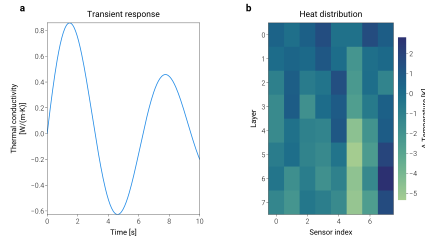
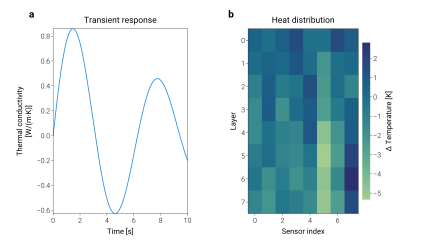

# Layout and Typography

## Layout optimization

For most figures, `simple_layout(fig)` is all you need — it automatically
optimizes margins so labels and titles don't clip or overlap:

```python
import dartwork_mpl as dm
import numpy as np

dm.style.use("scientific")

fig, ax = plt.subplots(figsize=dm.figsize("15cm", "wide"))
ax.plot(np.linspace(0, 10, 100), np.sin(np.linspace(0, 10, 100)), color="dc.ocean3")
ax.set_xlabel("Time [s]")
ax.set_ylabel("Response")

dm.simple_layout(fig)  # replaces fig.tight_layout — flush to figure edges
```

**Try it — drag the sliders to see how figure dimensions map onto an A4 page:**

```{raw} html
:file: images/ruler_widget.html
```

### Multi-panel figures

For multi-panel layouts, use GridSpec and pass it to `simple_layout`:

```python
fig = plt.figure(figsize=dm.figsize("15cm", "portrait"))
gs = fig.add_gridspec(2, 2, hspace=0.35, wspace=0.25)
axes = [fig.add_subplot(gs[i, j]) for i in range(2) for j in range(2)]

for ax in axes:
    ax.plot(np.linspace(0, 1, 40), np.random.rand(40), color="dc.ocean3", lw=0.8)

dm.label_axes(axes)                    # adds (a), (b), (c), (d) panel labels
dm.set_decimal(axes[0], xn=2, yn=1)    # format tick labels to fixed decimals

# Pass gs so simple_layout respects your GridSpec spacing
dm.simple_layout(fig, gs=gs)
```

:::{figure} images/layout_gridspec.svg
:alt: 2×2 GridSpec layout with panel labels and decimal formatting
:width: 100%
:::

> **Tip:** You generally don't need to set explicit `left`, `right`, `top`,
> `bottom` values on GridSpec — `simple_layout` finds optimal margins
> automatically. Only add manual margins when you need fine positional control
> (e.g., making room for a colorbar or external legend).

### Adding a buffer with `margin`

The default `simple_layout(fig)` snaps axes content (labels, ticks,
title, legend) flush against the figure edges. For a uniform inset
buffer, pass a `margin`:

```python
fig, ax = plt.subplots(figsize=dm.figsize("9cm", "standard"))
ax.plot(np.linspace(0, 10, 100), np.sin(np.linspace(0, 10, 100)))
ax.set_ylabel("Very Long Label That Might\nOverflow the Figure Bounds")
ax.set_title("Complex Multi-Line Title", fontsize=dm.fs(2))

dm.simple_layout(fig, margin="2%")        # uniform 2% buffer
dm.simple_layout(fig, margin=dm.mm(2))    # uniform 2 mm buffer
dm.simple_layout(fig, ml=dm.cm(1), mr="3%")  # per-side, mixed units
```

`margin` (and the per-side `ml`/`mr`/`mt`/`mb` overrides) accept any
of:

- :class:`Length` (`dm.cm(0.5)`, `dm.mm(5)`, `dm.inch(0.1)`,
  `dm.pt(12)`)
- unit string (`"5mm"`, `"0.5cm"`, `"0.1in"`, `"24pt"`)
- percentage string (`"5%"` = 5 % of the figure dimension)
- bare number (figure-fraction, so `0.05` = 5 %)

**How it works:**

1. Draws the figure once to populate text metrics.
2. Walks every visible artist on each axes (texts, title, axis labels,
   tick labels in view, axis offset text, legend) and computes the
   content-extent overhang relative to each axes' plot area.
3. Sets GridSpec edges arithmetically so the union of all axes
   content sits at exactly the requested distance from each figure
   edge.
4. Re-measures and re-applies until consecutive iterations agree to
   within 0.5 px (typically 2 iterations; up to 8 on AutoLocator
   fixed-points like long log-scale ranges).

No optimizer is involved — the result is fully deterministic.

### Data-range margins on individual axes

`dm.simple_layout` controls margins between the **axes content** and
the **figure edge**. For breathing room between the **plotted data**
and the **axes spines**, use matplotlib's built-in
`ax.margins(...)` — dartwork-mpl doesn't wrap it, since it's already a
one-liner:

```python
ax.margins(x=0.1, y=0.05)   # 10 % x-padding, 5 % y-padding
ax.margins(0.05)            # same value on both axes
```

Useful for:

- Preventing data from touching axis spines
- Creating visual breathing room around markers
- Ensuring scatter points and bar tops aren't clipped at boundaries

### Which call to use?

| Scenario | Call |
|---|---|
| Default — most figures | `dm.simple_layout(fig)` |
| Need a buffer between content and edge | `dm.simple_layout(fig, margin="2%")` or `margin=dm.mm(2)` |
| Per-side asymmetric margins | `dm.simple_layout(fig, ml=dm.cm(1), mr="3%", ...)` |
| Multi-panel via GridSpec | `dm.simple_layout(fig, gs=gs)` |
| Debugging layout convergence | `dm.simple_layout(fig, verbose=True)` |

The historical `dm.auto_layout(fig)` is now a deprecated alias that
forwards to `simple_layout`; new code should call `simple_layout`
directly.

### `simple_layout` vs `tight_layout`

Simple layouts look fine with either method. The real difference shows up when
figures get more complex — multi-panel grids, long axis labels, colorbars, and
titles all competing for space.

**Interactive visualizer — see how dartwork-mpl calculates margins dynamically:**

```{raw} html
:file: images/layout_debugger.html
```

Below is the **same figure** — a two-panel layout with a multi-line
y-label and a colorbar — rendered with each approach. The figure
background is tinted and edged so you can see how each method
negotiates the gap between the axes content and the figure rectangle
itself. **Click the tabs to toggle** the full-width rendering — that's
the only way to spot the lopsided whitespace and the shifted colorbar
without overlaying the two side-by-side.

::::{tab-set}

:::{tab-item} `simple_layout()` (dartwork-mpl)
:sync: dm


:::

:::{tab-item} `tight_layout()` (matplotlib)
:sync: mpl


:::

::::

**What's different?**

`tight_layout()` calculates padding heuristically — it tries to prevent
overlap but doesn't guarantee uniform margins or optimal use of space. When
panels have **different label lengths** (e.g., a multi-line ylabel vs. a
short one), or when a **colorbar** shifts the effective axes width, the
heuristic can produce lopsided spacing or wasted whitespace.

`simple_layout()` measures every visible artist on every axes and
arithmetically places the GridSpec so the content union lands at the
requested margin from each figure edge. This means:

- **Deterministic** — the same figure produces the same GridSpec
  (no optimizer, no scipy)
- **Content-complete** — sees titles, axis labels, view-limited tick
  labels, ScalarFormatter offset text, legends — everything that
  appears on the canvas
- **GridSpec-native** — pass `gs=gs` and it respects your
  `hspace`/`wspace` while only adjusting outer margins
- **Unit-flexible** — `margin` accepts `Length`, unit strings (`"5mm"`),
  percentages (`"5%"`), or figure-fractions

**Key layout functions:**

| Function                      | What it solves                                                |
| ----------------------------- | ------------------------------------------------------------- |
| `simple_layout(fig, gs=gs)`   | Places content at requested margin — replaces `tight_layout()` |
| `label_axes(axes)`            | Adds (a), (b), (c) labels with auto-positioning for ylabels   |
| `arrow_axis(ax, 'x', 'Cost')` | Creates `Low ◄── Cost ──► High` bidirectional annotations     |
| `set_decimal(ax, xn, yn)`     | Fixes tick decimal places for publication-ready labels        |
| `make_offset(x, y, fig)`      | Creates point-based offsets for precise text positioning      |
| `get_bounding_box(boxes)`     | Merges multiple axes bounding boxes into one                  |

## Annotation & Formatting

dartwork-mpl includes several helpers that automate tedious formatting tasks.

### Auto-aligned panel labels (`label_axes`)

Manually positioning `(a)`, `(b)`, `(c)` labels across panels with different y-axis label lengths often results in misaligned text. `dm.label_axes(axes)` calculates the bounding boxes of your y-labels and perfectly aligns the panel labels to the leftmost edge.

**Interactive visualizer — drag the slider to compare:**

```{raw} html
:file: images/label_axes_slider.html
```

### Consistent tick decimals (`set_decimal`)

Raw matplotlib ticks can sometimes mix integers and floats (e.g. `0.5`, `1`, `1.5`), which looks unprofessional. `dm.set_decimal()` forces consistent decimal places for publication-ready formatting.

```{raw} html
:file: images/set_decimal_slider.html
```

### Bidirectional arrow axes (`arrow_axis`)

For conceptual or qualitative plots (like "Risk vs Return"), drawing bidirectional label axes manually is surprisingly difficult in matplotlib. `dm.arrow_axis()` handles the positioning, offsets, and arrows automatically.

:::{figure} images/arrow_axis_example.svg
:alt: Arrow axis example showing Risk vs Expected Return
:width: 100%
:::

## Typography

```python
import dartwork_mpl as dm

dm.style.use("scientific-kr")  # English/Korean fonts set together

fig, ax = plt.subplots(figsize=dm.figsize("9cm", "standard"))
ax.plot([0, 1, 2], [0, 1, 0.4], color="dc.forest2", lw=dm.lw(0.5))
ax.set_title("Experiment result", fontsize=dm.fs(2), fontweight=dm.fw(1))
ax.set_xlabel("Time")
ax.set_ylabel("Response")
dm.simple_layout(fig)

# Preview bundled fonts
dm.plot_fonts(ncols=4, font_size=12)
```

:::{figure} images/layout_typography.svg
:alt: Typography demo with fs() and fw() font scaling helpers
:width: 100%
:::

**Scaling helpers:**

| Helper  | What it does                                                                  |
| ------- | ----------------------------------------------------------------------------- |
| `fs(n)` | Font size = base size + `n` points. `fs(0)` = base, `fs(2)` = 2pt larger      |
| `fw(n)` | Weight = base weight + `n` × 100. `fw(0)` = Light (300), `fw(4)` = Bold (700) |
| `lw(n)` | Line width relative to `lines.linewidth`. `lw(0)` = default                   |

See [Font Families](../fonts/families.md) for the full font catalog and
[Font Utilities](../fonts/utilities.md) for detailed usage.

## Before / after — twinx revenue / margin dashboard

A `twinx` chart is where margin discipline matters most: the left bar
axis, the right line axis, both ylabels, and the legend all compete
for breathing room. Drag the divider to compare vanilla
`tight_layout()` against `dm.simple_layout(fig, margin="2mm")` on the
exact same code.

```{raw} html
:file: ../_static/wipe_l4_dual.html
```

## See also

- **Next →** [Save and Validation](save_export.md) — multi-format export and automatic visual quality checks
- [API › Layout Utilities](../api/layout.rst) for all layout helper functions and arguments
- [Colors and Colormaps](colors.md) for named colors and gradients

:::{image} images/label_axes_vanilla.svg
:class: d-none
:::
:::{image} images/label_axes_dm.svg
:class: d-none
:::
:::{image} images/set_decimal_vanilla.svg
:class: d-none
:::
:::{image} images/set_decimal_dm.svg
:class: d-none
:::
